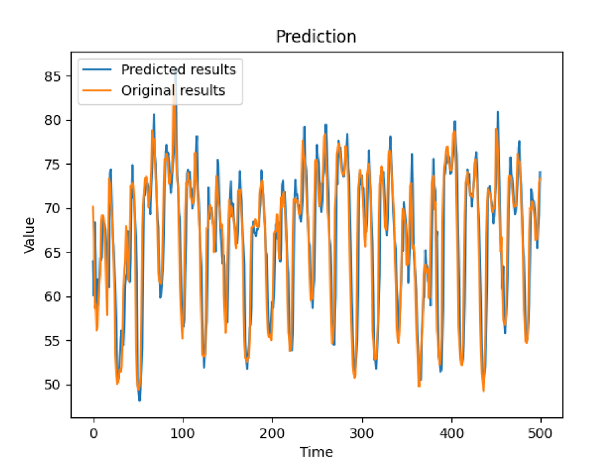
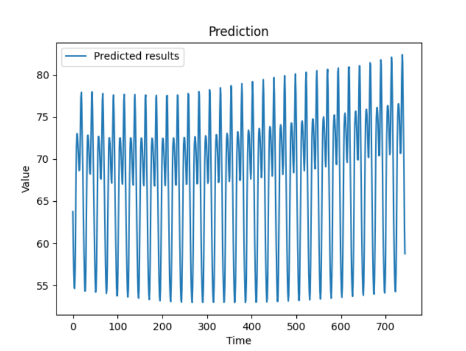

Download the docker image for this project in the link below\
https://hub.docker.com/repository/registry-1.docker.io/rishiswethan/aiforecasting/general

This project is meant to be a plug and play template, for anyone looking to build a univariate forecasting model using LSTM, GRU or RNN.
This can run on pretty much any univariate forecasting data, as long as it's correctly formatted,
as seen in the data/rt_benchmark_datasets. This capability is achived because it uses BayesianOptimization of Keras Tuner to find the right hyperparameters.
Other hyperparameters are automatically inferred by the program by looking at the properties of the data.
To have a quick look at how to execute this program, and which functions do what, check the _Run.py_ program and
have a look at the functions it calls for each user choice.

The program was tested on python 3.10.8, tensorflow 2.10.0 and was tested on windows 11 with a GTX 1080ti. It should work on other hardware and OS was well.

# How to run the program:
 - #### Follow these steps only if you are not using a docker image:
   - If windows, activate venv by running `venv/Scripts/activate` after extracting it from the zip file
   - If linux, install the requirements. I recommend using a venv so that you don't mess with your current installation
   - Run setup.py

- **Save** your train and test csv's in the respective training and testing folders.
- In the **_save_files/user_choice.json_**. Set choices for,
    - Which model you wish to use, _"model_choice"_ parameter. You have 3 options:
      - "LSTM_model"
      - "RNN_model"
      - "GRU_model"
    - If there are multiple id_names, like in the case of stock data which has multiple stock symbols. Choose the right id_name in the _"id_name"_ parameter. If this is not chosen,
the first id will be chosen by default.
- Use `docker run rishiswethan/aiforecasting python <program name>` to run the desired program. Use `python <program name>` in case you don't use docker
- **Use tune.py** to tune the model.
- **Use train.py** to train the program.
- **Use test.py** to test the model in the default (t+1) mode.
- See **source/run.py** or the commented out function calls in **test.py** to see how to run the other forecasting options you have.
- See **source/config.py** to change path names.

# Forecasting options:

### Option 1:
_(t+1) prediction_ means that you will be predicting only for the next day (t+1). To predict (t+2), 
t+1 will be the original correct value from the test set, and not the predicted value. This can obviously be more accurate,
because the model only predicts one day ahead, so that minor or major errors don't compound over time.

#### **t+1 prediction on test set of energy demand prediction data on LSTM:**

### Option 2:

The program can also forecast for x days without appending from the test set. 
Although it doesn't append from the test set, it can still test against it, as seen below.

#### **t+500 prediction compared against test set of energy demand prediction data on GRU:**

### Option 3:

This option allows you to blindly predict for as many days as you like, even if there is 
no test set to compare against. 

#### **t+500 prediction without test set of energy demand prediction data on RNN:**

