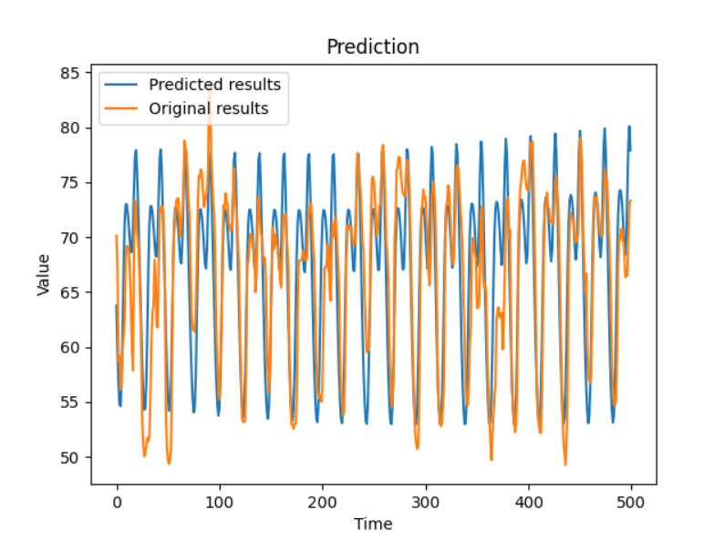

Download the Docker image for this project using the link below:
https://hub.docker.com/repository/registry-1.docker.io/rishiswethan/aiforecasting/general

This project serves as a user-friendly template designed for anyone seeking to build a univariate forecasting model using LSTM, GRU, or RNN. It can run on virtually any univariate forecasting dataset, provided that the data is appropriately formatted, as demonstrated in the data/rt_benchmark_datasets. This adaptability is achieved by utilizing Bayesian Optimization from Keras Tuner to identify the optimal hyperparameters. The program automatically infers other hyperparameters based on the properties of the input data. For a quick overview of how to execute this program and understand the functions associated with each user choice, please refer to the Run.py file.

The program has been tested on Python 3.10.8 and TensorFlow 2.10.0, running on Windows 11 with a GTX 1080 Ti. It should also function smoothly on other hardware and operating systems.

Feel free to reach out if you have any questions or need further assistance with the project.

# How to run the program:
 - #### Follow these steps only if you are not using a docker image:
   - Extract venv from the zip file
   - **If windows**, activate venv by running `venv/Scripts/activate`
   - **If linux**, install the requirements. I recommend using a new venv so that you don't mess with your current installation
   - Run **setup.py**

- **Save** your train and test csv's in the respective training and testing folders.
  - _*train.csv_ in _/ml_vol/inputs/data/training/forecasting_base_
  - _*test_key.csv_ in _/ml_vol/inputs/data/testing/forecasting_base_
  - _*schema.json_ in _/ml_vol/inputs/data_config_

- In the **_save_files/user_choice.json_**. Set choices for,
    - Which model you wish to use, _"model_choice"_ parameter. You have 3 options:
      - "LSTM_model"
      - "RNN_model"
      - "GRU_model"
    - If there are multiple id_names, like in the case of stock data which has multiple stock symbols. Choose the right id_name in the _"id_name"_ parameter. If this is not chosen,
the first id will be chosen by default.

- Use `docker run -it -v $(pwd)/docker_app/ml_vol:/opt/ml_vol rishiswethan/aiforecasting:latest <program name>` to run the desired program locally.
Use `python <program name>` in case you don't use docker
  - **Use tune** to tune the model.
  - **Use train** to train the program.
  - **Use test** to test the model in the default (t+1) mode.
  - **Use predict <num_of_days>** to forecast for n days without referring to a test set.

- See **source/run.py** or the commented out function calls in **test.py** to see how to run the other forecasting options you have.
- See **source/config.py** to change path names.

# Forecasting options:

### Option 1:
_(t+1) prediction_ means that you will be predicting only for the next day (t+1). To predict (t+2), 
t+1 will be the original correct value from the test set, and not the predicted value. This can obviously be more accurate,
because the model only predicts one day ahead, so that minor or major errors don't compound over time.

#### **t+1 prediction on test set of energy demand prediction data on LSTM:**

### Option 2:

The program can also forecast for x days without appending from the test set. 
Although it doesn't append from the test set, it can still test against it, as seen below.

#### **t+500 prediction compared against test set of energy demand prediction data on GRU:**

### Option 3:

This option allows you to blindly predict for as many days as you like, even if there is 
no test set to compare against. 

#### **t+500 prediction without test set of energy demand prediction data on RNN:**

